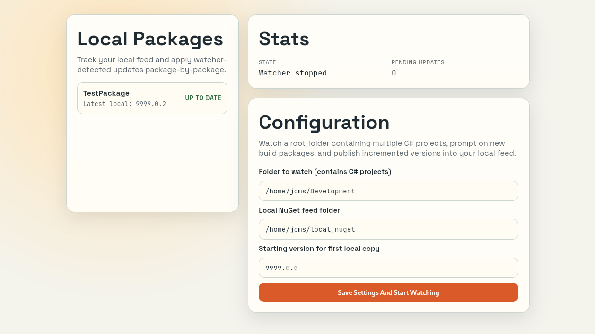

# Nugetter

Nugetter is a desktop app (Tauri + React + TypeScript + Rust) that automates a local NuGet publishing workflow for C# development.

It watches a root folder containing one or more C# projects, detects newly built package files, asks for approval, bumps the package version above the latest in your local feed, and copies the updated package there.



## Features

- Watches a project root recursively (multi-project support).
- Filters for package files produced by C# projects (`.csproj` ancestor + `bin` path).
- Debounces package reads so a single build does not trigger repeated processing.
- Prompts before copying each detected package.
- Repackages `.nupkg` and updates `.nuspec` `<version>` before copy.
- Calculates next version above the highest package version already in destination.
- Saves settings only on explicit submit (no live backend updates while typing).
- Generates platform icon assets from a single SVG source during build.

## How It Works

1. You set:
- `watch path`: folder containing C# projects
- `destination path`: local NuGet feed folder

2. On submit, backend starts/refreshes watcher.

3. On new package event:
- watcher validates file path
- debounces and retries if file is still being written
- reads package metadata (`id`, `version`)
- computes `nextVersion`
- emits `package-detected` event to frontend

4. On approval:
- backend rewrites `.nuspec` version inside package
- writes package to destination as `PackageId.NextVersion.nupkg`

## Quick Start (Users)

Nugetter is intended to be used as a prebuilt desktop binary.

1. Download the latest release binary/package for your OS.
2. Install or run the app.
3. Configure:
- watch path (folder containing your C# projects)
- destination path (your local NuGet feed folder)

You do not need Node.js, npm, Rust, or other developer tooling to use the released app.

## Development Setup

### Development Prerequisites

- Node.js 18+
- npm
- Rust toolchain (stable)
- System dependencies required by Tauri (Linux desktop libs, etc.)

### Install Dependencies

```bash
npm install
```

### Run in Dev Mode

```bash
npm run tauri dev
```

### Build Frontend (Also Regenerates Icons)

```bash
npm run build
```

### Run Backend Unit Tests

```bash
cd src-tauri
cargo test --lib
```

## Scripts

- `npm run dev`: start Vite frontend only
- `npm run tauri dev`: start full desktop app
- `npm run generate:icons`: generate icon set from `src-tauri/icons/logo.svg`
- `npm run build`: generate icons + typecheck + frontend build
- `npm run preview`: preview built frontend

## Icon and Logo Pipeline

- Source logo: `src-tauri/icons/logo.svg`
- Generated icon outputs: `src-tauri/icons/` (`.png`, `.ico`, `.icns`, platform sizes)

Regenerate manually:

```bash
npm run generate:icons
```

## Project Structure

### Frontend (`src/`)

- `App.tsx`: app orchestration and state
- `components/SettingsCard.tsx`: settings form/status panel
- `components/DetectedPackageCard.tsx`: approval prompt card
- `components/ui/Card.tsx`: reusable card primitive
- `components/ui/Button.tsx`: reusable button with variants
- `constants.ts`: frontend command/event/storage keys
- `types.ts`: shared frontend types

### Backend (`src-tauri/src/`)

- `lib.rs`: Tauri composition and command registration
- `commands.rs`: Tauri command handlers
- `state.rs`: app state and pending request storage
- `watcher.rs`: filesystem watching, debounce/retry queue, event filtering
- `nuget.rs`: package metadata parsing and repack/version logic
- `models.rs`: backend DTO/state models
- `ui_events.rs`: backend -> frontend event emission

## Watcher Rules

A file is considered a candidate package when:

- extension is `.nupkg` or `.nuget` (case-insensitive)
- it is a real file
- it is under the selected watch root
- its path includes a `bin` directory segment
- an ancestor directory up to watch root contains a `.csproj`

## Troubleshooting

### No package prompt appears

1. Ensure watch path points to the parent folder containing your `.csproj` projects.
2. Ensure your build output package is inside a `bin/...` path.
3. Ensure package file extension is `.nupkg`.
4. Check terminal logs for watcher diagnostics:
- lines are prefixed with `[nugetter-watcher]`
- includes reject reasons for skipped candidates

### Prompt appears but copy fails

1. Verify destination path is writable.
2. Verify package contains a `.nuspec` with `<id>` and `<version>`.
3. Check terminal for emitted backend error details.

### Version behavior notes

- If package version is valid semver, patch is incremented above highest existing version in destination for same package id.
- If version cannot be parsed as semver, fallback format is `currentVersion.1`.

## Notes

- Settings persist in frontend local storage and backend in-memory state.
- Backend watcher diagnostics are intentionally verbose to help debug path/event issues.
